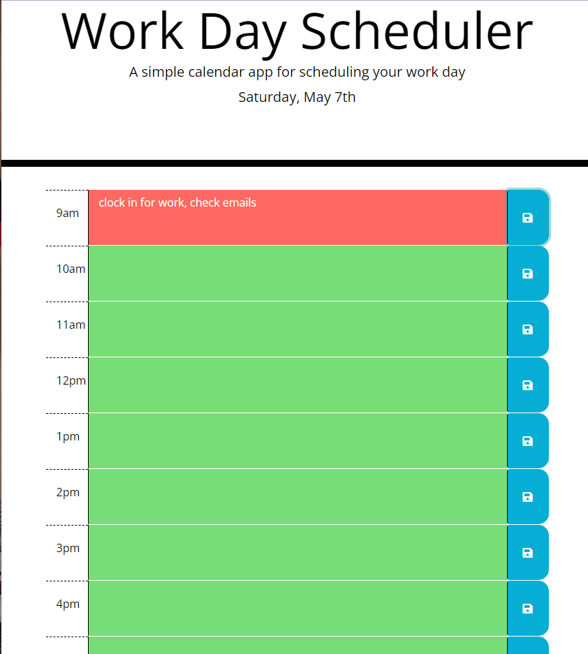

# My-Work-Day-Scheduler

I want to create a simple calendar application that allows a user to save events for each hour of the day.  This app will run in the browser and feature dynamically updated HTML and CSS powered by jQuery and Moment.js.  The started code also includes Bootstrap, Fontawesome, and Google Fonts.  This is app is a great example because it combines a combination of almost everything we have learned so far in class.

## Acceptance Criteria

```
GIVEN I am using a daily planner to create a schedule
WHEN I open the planner
THEN the current day is displayed at the top of the calendar
WHEN I scroll down
THEN I am presented with timeblocks for standard business hours
WHEN I view the timeblocks for that day
THEN each timeblock is color coded to indicate whether it is in the past, present, or future
WHEN I click into a timeblock
THEN I can enter an event
WHEN I click the save button for that timeblock
THEN the text for that event is saved in local storage
WHEN I refresh the page
THEN the saved events persist
```

[Link to deployed application] (https://tkhobbes43.github.io/my-work-day-scheduler/)

